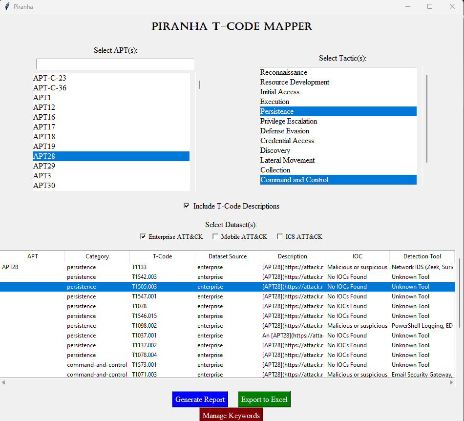

# **PIRANHA - APT Threat Intelligence & IOC Correlation Tool**  

## **Overview**  
PIRANHA is a **cyber threat intelligence tool** designed to map **MITRE ATT&CK** techniques used by **Advanced Persistent Threats (APTs)** to relevant **Indicators of Compromise (IOCs)**.  
This tool **automatically analyzes descriptions** of APT tactics and techniques, extracts meaningful keywords, and generates **custom threat reports** with detection tools and IOCs.

---

## **Features**
**APT Technique Mapping** - Retrieve techniques used by APT groups from **MITRE ATT&CK datasets**.  
**APT-Specific Descriptions** - Uses **APT-specific JSON data** for more accurate descriptions.  
**Keyword-Based IOC Mapping** - Maps keywords in descriptions to pre-defined IOCs.  
**Multi-Dataset Support** - Supports **Enterprise, Mobile, and ICS** ATT&CK datasets.  
**Dynamic Keyword Management** - Add new **keywords, IOCs, and detection tools** manually.  
**Export Reports** - Generate **Excel reports** with categorized threat intelligence data.  

---

## **Compiling**
**1: Unzip matrices.zip**, move the extracted files into the **piranha** directory.
```bash
powershell.exe -c "Expand-Archive -Force matrices.zip"
move .\matrices\matrices* .
```
**2: Install** python requirements.
```bash
pip install -r requirements.txt
```
**3: Compile** using **pyinstaller** from the **piranha** directory.
```bash
pyinstaller --noconsole --icon=.\images\pin.ico --add-data "files;files" --add-data "files/APT;files/APT" --add-data "enterprise-attack.json;." --add-data "mobile-attack.json;." --add-data "ics-attack.json;." piranha.py
```

## **Command Line**
****1: Unzip matrices.zip**, move the extracted files into the **piranha** directory.
```bash
powershell.exe -c "Expand-Archive -Force matrices.zip"
move .\matrices\matrices* .
```
**2: Install** python requirements.
```bash
pip install -r requirements.txt
```
**3: Use **python** to run piranha.py.
```bash
python piranha.py
```


